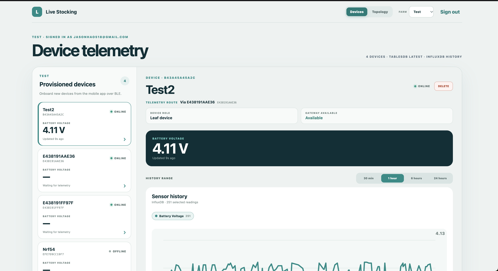
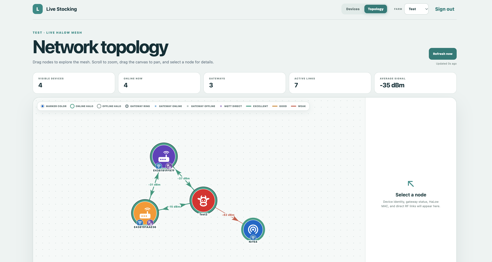
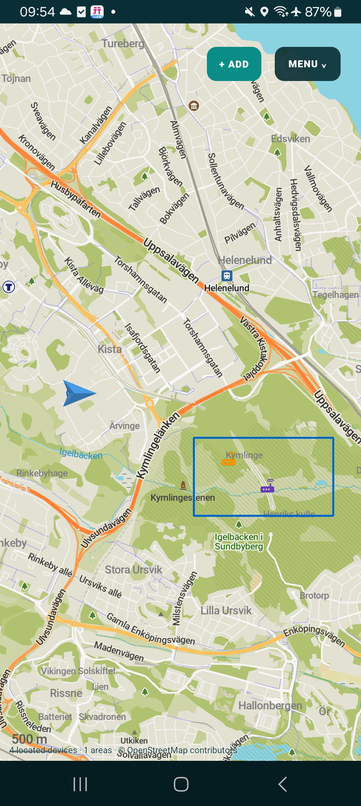
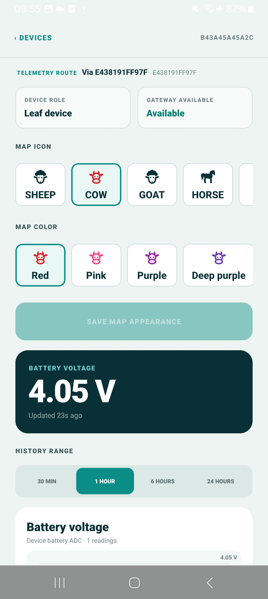
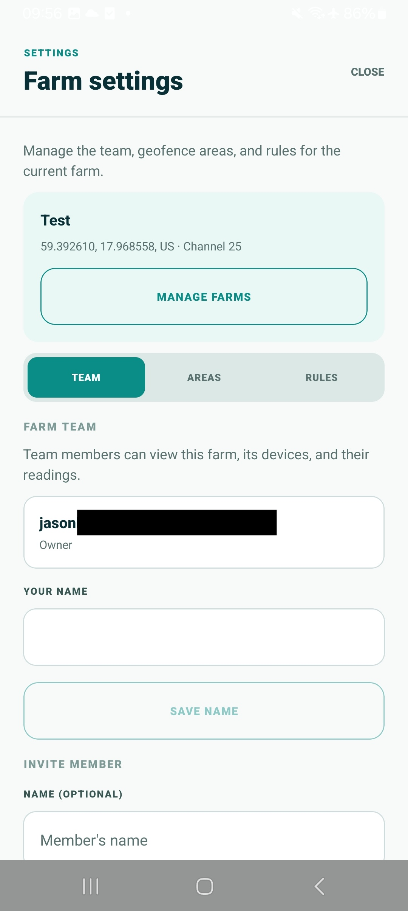
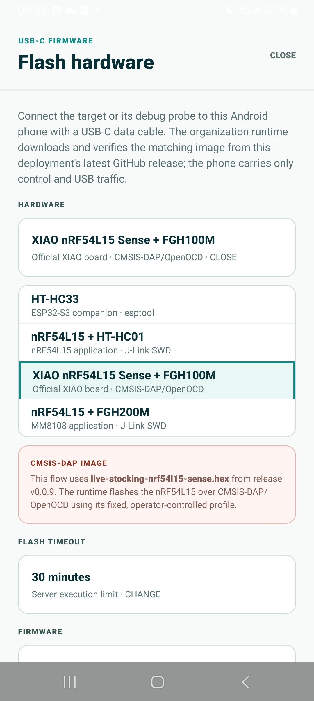

# Live Stocking

An Appwrite + Next.js + React Native + ESP32-S3 starter for authenticated device
onboarding, offline device mapping, Wi-Fi HaLow provisioning, and MQTT telemetry.
It mirrors the five-part structure of Hello Channels while giving each folder a
provisioning-specific responsibility.

[](https://github.com/new?template_name=template-live-stocking&template_owner=edgez-ai)
[](https://appwrite.edgez.ai/console/deploy?repo=https%3A%2F%2Fgithub.com%2Fedgez-ai%2Ftemplate-live-stocking)

## Product tour

Live Stocking gives operators a shared view of livestock trackers from the web
and an Android companion for field work, provisioning, and maintenance.

### Monitor device telemetry

The web portal lists every device in the selected farm, shows whether it is
online, identifies the gateway carrying its telemetry, and highlights its latest
sensor reading. Operators can select a 30-minute, 1-hour, 6-hour, or 24-hour
history window to inspect battery voltage and other numeric sensor fields.



### Inspect the HaLow mesh

The interactive topology view turns recent gateway reports into a live network
graph. Summary cards show visible and online devices, gateways, active links,
and average signal strength. Link colors make excellent, good, and weak RSSI
paths easy to compare, while selecting a node reveals its identity, gateway
state, HaLow MAC address, and direct RF links.



### Operate in the field

The Android app centers field work on an offline-capable map. It plots devices
using their latest reported coordinates, overlays configured farm areas, and
keeps key farm, device, telemetry, area, and rule data available when the
network is unavailable.

<p align="center">
  
</p>

Each device has a detailed operational view. It shows the current telemetry
route and gateway availability, lets the operator choose the animal icon and
marker color used on the map, and presents the latest battery voltage together
with selectable history ranges.

<p align="center">
  
</p>

### Manage farms and access

Farm settings bring the operational boundary into one place. Owners can manage
farm details, team membership, geofence areas, and rules. Team members receive
access to the farm and the device readings permitted through its Appwrite team.

<p align="center">
  
</p>

### Flash supported hardware from Android

The USB-C firmware workflow lets an authorized operator select the exact board
profile and flash a release image through the connected Android phone. The
organization runtime downloads the matching asset from the deployment's latest
GitHub release, verifies it, and performs the board-specific flashing flow; the
phone carries the control and USB traffic.

<p align="center">
  
</p>

## Limitations

This template is intentionally a simple demonstration rather than a
production-ready deployment:

| Capability | This demo | EdgeZ Enterprise |
| --- | --- | --- |
| Network topology | Simple sensor → relay node → Wi-Fi → MQTT path | Multi-hop, full-mesh architecture |
| Internet connectivity | Single Wi-Fi gateway | Multiple internet gateways |
| Device power model | Always on | Low-power PAwR-based operation |
| Communication | Simple uplink telemetry | Reliable bidirectional communication |
| Deployment readiness | Demonstration only | Production-ready with enterprise support |

Need the enterprise capabilities? Contact us to discuss your architecture,
hardware integration, and deployment requirements.

## Repository layout

| Folder | Purpose |
| --- | --- |
| `site/` | Read-only Next.js portal for sign-in, devices, and telemetry |
| `app/` | Expo app with an offline Organic Maps dashboard and BLE HaLow provisioning |
| `function/` | Trusted MQTT webhook that writes history to Time Series and the latest state to TablesDB |
| `firmware/` | PlatformIO + ESP-IDF device client |
| `infra/` | Rerunnable Appwrite CLI installer |

The root `edgez.json` selects `appwrite.config.json` as the complete,
version-controlled solution plan. **Deploy on EdgeZ** applies the auth methods,
web and Android platforms, project Time Series Store, latest-state database and
indexes, MQTT Function, Site, variables, domains, and both source deployments
after project selection.
Its `buildInstance` accepts `tiny`, `small`, `medium`, or `large`; this template
defaults to `tiny` for both Site and Function builds.

Open `live-stocking.code-workspace` in VS Code to work on all five folders.

## Provisioning flow

1. The ESP32 derives the serial as the 12 uppercase hexadecimal characters of
   its Wi-Fi MAC and advertises `PROV_<serial>` over BLE.
2. An operator signs in and creates a farm and Appwrite team. Farm settings include
   a map location, a Morse Micro country and 1 MHz HaLow channel, and mesh credentials.
3. The mobile app strips the `PROV_` prefix, creates an Appwrite Device with that
   project-unique serial and farm ID, and creates its one-time MQTT credential
   through the Devices API. The operator can leave device location unset, use the
   phone's current location, or choose coordinates on the offline map. Selected
   coordinates are stored in device metadata and shown on the farm map.
4. The operator chooses whether the ESP32 has upstream Wi-Fi. The app sends the
   farm's mesh settings, device location, and MQTT credential together through
   the `mqtt-config` BLE endpoint, then provisions upstream Wi-Fi when selected.
   Firmware connects to `mqtts://mqtt.edgez.ai:8883`, verifying the Let's Encrypt
   chain with ESP-IDF's trusted root bundle.
5. The device publishes JSON to
   `projects/<projectId>/devices/<serial>/telemetry/<channel>`. Appwrite's EMQX
   ACL allows that serial to publish only beneath its own telemetry/events
   topics and subscribe only beneath its own commands topic.
   A HaLow-only leaf sends only its JSON payload over BATMAN-adv-lite. The
   upstream gateway constructs its own `telemetry/status` MQTT topic and
   publishes the unchanged payload, so the gateway ACL accepts the message.
   Commands take the reverse path under the gateway's own authorized namespace:
   `commands/proxy/<leafSerial>/<command>`. The gateway removes that routing
   prefix, restores the leaf's normal command topic, and forwards the MQTT
   payload bytes unchanged over BATMAN-adv.
   The payload's Appwrite `clientId` assigns each telemetry and topology report
   and its read permissions to the originating leaf device.
   Firmware reads the HT-HC33 battery ADC every 30 seconds and publishes one
   `status` message with online state, optional `batteryVoltageMv` in millivolts,
   optional provisioning coordinates, and its recently observed direct HaLow
   peers.
6. Appwrite resolves the MQTT client and emits
   `devices.<deviceId>.mqtt.message.publish` to the Function.
7. The Function verifies the topic project and serial against the built-in
   device, writes the complete reading to the project's Time Series Store, and
   upserts one latest `telemetry` row per device carrying that device's read
   permissions. It also upserts the gateway's current links in `topology-links`.
8. Web and mobile read current state and topology from TablesDB, then query
   historical sensor fields from Time Series with an Appwrite JWT. Each device
   uses the deterministic `device_<deviceId>` measurement. Numeric sensor type
   indexes are stored under text fields such as `sensor_temperature` and
   `sensor_battery_voltage`; GPS is stored as numeric `lat` and `lon` fields so
   Flux's built-in `experimental/geo` package can shape and range-filter it.
   The latest TablesDB telemetry row also stores the same fix in a spatially
   indexed `location` point using `[longitude, latitude]`, allowing queries such
   as `Query.distanceLessThan("location", [longitude, latitude], radiusMeters)`.
   Its `icon` and `markerColor` fields mirror Device metadata so a spatial query
   returns everything needed to draw the device marker.
   They display only active links reported within the last two minutes, so an
   offline gateway cannot leave stale topology visible.

Web and mobile can request an HT-HC33 firmware update. The repository is taken
from Appwrite's deployment-provided `APPWRITE_VCS_REPOSITORY_URL` (or GitHub
Actions' `GITHUB_REPOSITORY` for mobile), so **Deploy on EdgeZ** installations
use their own latest release instead of a fixed template repository. Only users
with update permission on the Device can publish its MQTT OTA command.

The mobile app caches each signed-in user's farms, geofence areas and rules,
devices, latest telemetry, and mobile GPS trace points for offline map rendering.
The **Trace** menu can opt into background movement tracking, choose a one-, five-,
or fifteen-minute save interval, and preview one hour through seven days as a
route on the offline map. Trace points are timestamped locally first, uploaded to
the private row-secured `mobile-trace-points` table when Appwrite is reachable,
and retained in the local queue while offline. Farm mesh passphrases and MQTT
credentials are not stored in this offline cache; provisioning and edits require
a connection.

## Environment

The managed workspace injects:

```sh
APP_NAME=<workspace-name>
DOMAIN_SUFFIX=edgez.biz
APPWRITE_ENDPOINT=<appwrite-endpoint>
APPWRITE_PUBLIC_ENDPOINT=<optional-browser-safe-appwrite-endpoint>
APPWRITE_PROJECT_ID=<project-id>
APPWRITE_PROJECT_NAME=<dns-safe-project-name>
APPWRITE_API_KEY=<server-api-key>
```

Stable database and table IDs come directly from `appwrite.config.json`; the
template does not require a committed `.env.local` file.

`APPWRITE_ENDPOINT` configures the server-side CLI. Browser and mobile builds
use `APPWRITE_PUBLIC_ENDPOINT` when provided; otherwise a non-local HTTP
endpoint is automatically upgraded to HTTPS to prevent mixed-content errors.

For GitHub Actions mobile builds, set the repository Actions variable or secret
`APPWRITE_PROJECT_ID` to the deployed Appwrite project ID. The build embeds this
ID in the Android app's Appwrite client configuration.

All clients derive the Function URL as
`https://${APPWRITE_PROJECT_NAME}-${APP_NAME}.functions.${DOMAIN_SUFFIX}`.
The web/mobile clients also receive the public Appwrite endpoint, project ID,
and non-secret table IDs. The API key is used by `infra/` only. Appwrite's
server-level EMQX secret remains outside this application repository.

## Local validation

Install dependencies in `site/`, `app/`, `function/`, and `infra/`, then run:

```sh
(cd site && npm run typecheck && npm run build)
(cd app && npm run typecheck)
(cd function && npm run check)
(cd infra && npm run check)
(cd firmware && pio run)
```

Remote installation is intentionally separate: run `cd infra && npm run deploy`
only when you intend to provision or update Appwrite resources.
Run `cd infra && npm run clean` to remove this template's Site, Function,
database, Time Series Store, proxy rule, and auth platforms. Cleanup preserves
project users, Devices, and project-wide authentication settings.

## RSSI fingerprint localization experiment

`localization/` provides dependency-free Python tools that export GPS-labelled
multi-relay RSSI fingerprints from the project's existing Time Series Store,
evaluate a weighted KNN baseline, create a portable JSON model, and run a
single prediction. It uses the raw telemetry payload already retained in time
series and does not change the deployed application. See
[`localization/README.md`](localization/README.md) for the supported telemetry
shapes and commands.

## Release builds

The separate `Build firmware` and `Build mobile app` GitHub Actions workflows
run when a GitHub Release is published and can each be started independently
with **Run workflow**. Firmware produces `live-stocking-flash.bin` for flashing
at address `0x0`, `live-stocking-ota.bin` as the app-only OTA payload, and
`live-stocking-nrf54l15.hex` for the nRF54L15/MM6108 FGH100M carrier,
`live-stocking-nrf54l15-sense.hex` for the official XIAO nRF54L15 Sense with
the FGH100M shield,
`live-stocking-hc01.hex` for the nRF54L15/MM6108 HT-HC01 carrier, and
`live-stocking-fgh200m.hex` for the nRF54L15/MM8108 FGH200M carrier. Mobile
produces `live-stocking-signed.apk` and `live-stocking-unsigned.apk`. These eight
files are attached to a GitHub Release; the workflow-run artifacts contain the
same files. All nRF54L15 jobs use the source-free, dual-chip package checked
into `firmware/modules/mm-iot-zephyr-prebuilt`; it selects MM6108 for FGH100M,
Sense and HT-HC01, and MM8108 for FGH200M, without another repository checkout.

The signed APK uses the repository Actions secrets `ANDROID_KEYSTORE_BASE64`
and `ANDROID_KEYSTORE_PASSWORD`, and the Actions variable `ANDROID_KEY_ALIAS`.
The upload keystore and password have an ignored local backup in `app/signing/`;
back them up securely before deleting that directory. The unsigned APK is for
separate signing and cannot be installed as-is.
